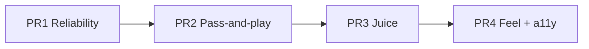

# Flip Game — Gameplay Improvements (Design & Implementation Spec)

A detailed, code-level specification for ten gameplay / feel / UX / robustness
improvements to Flip Game. This document is the source of truth for the
follow-up implementation PRs. It complements (does not replace) `HANDOFF.md`.

---

## Purpose

Improve how the game **feels and plays** — reliability on the target classroom
Android panel, pass-and-play clarity, "juice", learnability, and accessibility —
**without touching the locked rules**.

## Guardrail: the rules are LOCKED

Nothing in this document changes the scoring/rules logic in
[js/game.js](js/game.js). Specifically untouched:

- 10 starting lives, 2–8 players, pass-and-play.
- Point-count stake (`+1` per make, a miss costs `pointCount` lives then resets to 1).
- Heating Up (2 makes) / ON FIRE (3 makes), ON FIRE `+1 life` per make, miss ends the run with no penalty.
- Elimination at 0 lives, last-player-standing wins, winner starts next game.

`game.js` stays a **pure, DOM-free, render-free state machine**. Any new
*display-only* state introduced below (e.g. "so close", "awaiting handoff")
lives in [js/main.js](js/main.js) / [js/renderer.js](js/renderer.js), never in the rules.

## Release ritual (do not forget)

This is a no-build static PWA. After changing **any** game file, bump
`CACHE_NAME` in [service-worker.js](service-worker.js) (`flipgame-v3` → `flipgame-v4`,
etc.). Otherwise installed copies serve the old cached build forever. Also keep
all asset paths **relative** (the site lives at the `/flipgame/` subpath).

## PR map

| PR | Theme | Items | Files |
|----|-------|-------|-------|
| **PR 1** | Reliability on the panel | 1 Input hardening, 2 `roundRect` polyfill | `input.js`, `renderer.js` |
| **PR 2** | Pass-and-play flow | 3 Turn-handoff gate, 4 Hint + first-launch tutorial | `index.html`, `css/style.css`, `main.js` |
| **PR 3** | Juice / game feel | 5 MAKE burst + MISS shake + result pop, 6 "So close!" near-miss | `renderer.js`, `physics.js`, `main.js` |
| **PR 4** | Feel + a11y + ergonomics | 7 Feel toggle + strength readout, 8 AI cadence, 9 Mute + reduced-motion, 10 Fullscreen + wake lock, plus small notes | `physics.js`, `index.html`, `css/style.css`, `main.js`, `audio.js` |

Each PR is independently shippable and bumps `CACHE_NAME` once.

---

# PR 1 — Reliability on the target panel

These two are not polish; they are "the game misbehaves / doesn't render" bugs
on the exact delivery hardware (an IR touch panel running an older Android
System WebView, per `HANDOFF.md` Option C).

## Item 1 — Input hardening (pointerId + palm-rejection)

### Problem

[js/input.js](js/input.js) uses one global pointer with no `pointerId`, and
`pointercancel` is wired straight into `onUp`:

```19:23:js/input.js
    canvas.addEventListener('pointerdown',  onDown);
    canvas.addEventListener('pointermove',  onMove);
    canvas.addEventListener('pointerup',    onUp);
    canvas.addEventListener('pointercancel', onUp);
```

```56:71:js/input.js
  function onUp(e) {
    if (!dragging || !enabled) return;
    dragging = false;

    const dx = curX - startX, dy = curY - startY;
    const dist = Math.hypot(dx, dy);
    if (dist < MIN_DRAG) return;

    // Use the gesture's peak velocity. Fall back to a distance estimate if
    // we somehow captured almost no motion (e.g. one big jump then release).
    let vx = peakVx, vy = peakVy;
    if (peakSpeed < 80) { vx = dx * 10; vy = dy * 10; }

    lastFlick = { vx: Math.round(vx), vy: Math.round(vy), peak: Math.round(peakSpeed) };
    onFlick(vx, vy);
  }
```

Two real failure modes on a touch panel:

1. **Multi-touch corruption** — a second finger/palm landing mid-flick re-enters
   `onDown` and overwrites `startX/startY/peakSpeed`, scrambling the in-flight gesture.
2. **Phantom flick on palm rejection** — `pointercancel` runs the same `onUp`
   path, so a rejected touch that traveled past `MIN_DRAG` fires a real flick.

### Proposed code — full rewritten `input.js`

Lock onto the first pointer id for the whole gesture; ignore every other
pointer; route `pointercancel` to a `cancel()` that resets **without** firing a
flick. Peak-velocity capture and the `MIN_DRAG` fallback are unchanged.

```javascript
// input.js — pointer flick detection (mouse + touch unified)

const Input = (() => {
  const MIN_DRAG = 22;   // px — small dead zone so a quick flick registers

  let canvas, onFlick;
  let dragging = false;
  let activePointerId = null;                  // lock onto ONE pointer per gesture
  let startX = 0, startY = 0;
  let curX = 0, curY = 0;
  let lastX = 0, lastY = 0, lastT = 0;
  let peakSpeed = 0, peakVx = 0, peakVy = 0;   // fastest instant of the gesture
  let enabled = false;
  let lastFlick = null;                         // debug: last flick vector

  function attach(cvs, flickCallback) {
    canvas  = cvs;
    onFlick = flickCallback;

    canvas.addEventListener('pointerdown',   onDown);
    canvas.addEventListener('pointermove',   onMove);
    canvas.addEventListener('pointerup',     onUp);
    canvas.addEventListener('pointercancel', onCancel);   // phantom-flick guard
  }

  function enable()  { enabled = true;  }
  function disable() { enabled = false; releaseGesture(); }

  function onDown(e) {
    if (!enabled) return;
    if (activePointerId !== null) return;       // already tracking a finger — ignore the 2nd
    e.preventDefault();
    activePointerId = e.pointerId;
    try { canvas.setPointerCapture(e.pointerId); } catch (_) {}
    dragging = true;
    const r = canvas.getBoundingClientRect();
    startX = curX = lastX = e.clientX - r.left;
    startY = curY = lastY = e.clientY - r.top;
    lastT = performance.now();
    peakSpeed = peakVx = peakVy = 0;
  }

  function onMove(e) {
    if (!dragging || e.pointerId !== activePointerId) return;
    e.preventDefault();
    const r = canvas.getBoundingClientRect();
    curX = e.clientX - r.left;
    curY = e.clientY - r.top;
    const now = performance.now();
    const dt = Math.max((now - lastT) / 1000, 0.001);
    const ivx = (curX - lastX) / dt;            // instantaneous velocity this sample
    const ivy = (curY - lastY) / dt;
    const spd = Math.hypot(ivx, ivy);
    // Capture the fastest instant — that's the "snap", robust to a pause
    // before release (which would otherwise read as zero velocity).
    if (spd > peakSpeed) { peakSpeed = spd; peakVx = ivx; peakVy = ivy; }
    lastX = curX; lastY = curY; lastT = now;
  }

  function onUp(e) {
    if (!dragging || e.pointerId !== activePointerId) return;
    const dx = curX - startX, dy = curY - startY;
    const dist = Math.hypot(dx, dy);
    releaseGesture(e);                           // clear state BEFORE the callback

    if (!enabled || dist < MIN_DRAG) return;

    // Use the gesture's peak velocity. Fall back to a distance estimate if
    // we somehow captured almost no motion (e.g. one big jump then release).
    let vx = peakVx, vy = peakVy;
    if (peakSpeed < 80) { vx = dx * 10; vy = dy * 10; }

    lastFlick = { vx: Math.round(vx), vy: Math.round(vy), peak: Math.round(peakSpeed) };
    onFlick(vx, vy);
  }

  // pointercancel (palm rejection, OS gesture steal): reset, do NOT fire a flick.
  function onCancel(e) {
    if (e.pointerId !== activePointerId) return;
    releaseGesture(e);
  }

  function releaseGesture(e) {
    dragging = false;
    if (activePointerId !== null) {
      try { if (e) canvas.releasePointerCapture(activePointerId); } catch (_) {}
    }
    activePointerId = null;
  }

  function getLastFlick() { return lastFlick; }

  // Returns drag vector for drawing the preview arrow
  function getDragState() {
    if (!dragging) return null;
    return { startX, startY, curX, curY };
  }

  return { attach, enable, disable, getDragState, getLastFlick };
})();
```

### Notes / risk

- `setPointerCapture` is harmless if unsupported (wrapped in `try/catch`).
- `disable()` now also clears any in-flight gesture so a turn change can't leave
  a half-captured pointer — important because [js/main.js](js/main.js) calls
  `Input.disable()` the instant a flick is accepted.
- Mouse play is unaffected (a mouse is a single pointer id).
- **Risk: low.** Pure input layer; no rule or physics interaction.

## Item 2 — `roundRect` polyfill

### Problem

The renderer relies on `ctx.roundRect` in several places (body, neck, label,
cap). On an older Android System WebView (the bundled offline APK target) this
method may be missing — it throws, the draw loop aborts, and the canvas goes
blank.

```141:141:js/renderer.js
    const traceBody = () => { ctx.beginPath(); ctx.roundRect(-37, -72, 74, 115, 10); };
```

Other call sites: the neck (`roundRect(-22, -122, 44, 40, 7)`), the label band
(`roundRect(-35, -58, 70, 28, 4)`), the cap (`roundRect(-24, -146, 48, 26, 6)`
and `roundRect(-21, -144, 12, 7, 2)`).

### Proposed code — feature-detect + polyfill at the top of `renderer.js`

Install once, before the `Renderer` IIFE body runs. Supports both the numeric
and per-corner radius forms used by the spec (current code only passes a single
number, so the array branch is future-proofing).

```javascript
// renderer.js — canvas draw loop

// roundRect polyfill — older Android System WebViews (the bundled offline APK
// target) lack CanvasRenderingContext2D.roundRect; without this the draw loop
// throws and the canvas renders blank. Manual arc/line fallback.
if (typeof CanvasRenderingContext2D !== 'undefined' &&
    !CanvasRenderingContext2D.prototype.roundRect) {
  CanvasRenderingContext2D.prototype.roundRect = function (x, y, w, h, r) {
    let radii = typeof r === 'number' ? [r, r, r, r]
              : (Array.isArray(r) ? r : [0, 0, 0, 0]);
    if (radii.length === 1) radii = [radii[0], radii[0], radii[0], radii[0]];
    if (radii.length === 2) radii = [radii[0], radii[1], radii[0], radii[1]];
    let [tl, tr, br, bl] = radii;
    const max = Math.min(Math.abs(w), Math.abs(h)) / 2;     // clamp oversized radii
    tl = Math.min(tl, max); tr = Math.min(tr, max);
    br = Math.min(br, max); bl = Math.min(bl, max);
    this.moveTo(x + tl, y);
    this.arcTo(x + w, y,     x + w, y + h, tr);
    this.arcTo(x + w, y + h, x,     y + h, br);
    this.arcTo(x,     y + h, x,     y,     bl);
    this.arcTo(x,     y,     x + w, y,     tl);
    this.closePath();
    return this;
  };
}

const Renderer = (() => {
  // ...unchanged...
```

### Notes / risk

- The polyfill mirrors the native contract: it appends a subpath to the current
  path (callers always wrap it in their own `beginPath()`/`fill()`/`clip()`),
  so no existing call site needs to change.
- `arcTo` is ancient and universally supported.
- **Risk: very low.** Only installs when `roundRect` is absent.

---

# PR 2 — Pass-and-play flow

## Item 3 — Turn-handoff gate overlay

### Problem

A turn change only swaps the text in `#turn-banner` and immediately enables
input:

```285:288:js/main.js
    } else {
      turnBannerEl.textContent = `${p.name}'s turn`;
      Input.enable();
    }
```

In a room: the next player may not realize it's their turn, and the previous
player's follow-through can fire an accidental flick. A full-screen handoff gate
fixes both at once: it is unmistakable across a room, and input only arms after
an explicit tap.

### Behavior

- Shown only for **human** turns in a **non-practice** game (skip AI and Practice — those flick automatically / are solo).
- Big "PASS TO {name}" + "Tap to flip", tinted with the player's flavor color.
- Tapping the overlay hides it and calls `Input.enable()`.
- Re-used for the ON FIRE continuation turn (still the same human, but a clear "keep going" beat is fine — see options note).

### Proposed DOM — [index.html](index.html)

Add inside `#game-screen`, after `#player-list`:

```html
    <div id="handoff-overlay" class="hidden">
      <div class="handoff-card">
        <div class="handoff-label">Pass to</div>
        <div id="handoff-name" class="handoff-name"></div>
        <div class="handoff-tap">Tap anywhere to flip</div>
      </div>
    </div>
```

`#handoff-overlay` must be interactive even though `#game-screen` sets
`pointer-events: none`, so the overlay re-enables pointer events (CSS below).

### Proposed CSS — [css/style.css](css/style.css)

```css
/* ── Turn-handoff gate ───────────────────────────────────── */
#handoff-overlay {
  position: fixed;
  inset: 0;
  z-index: 20;
  display: flex;
  align-items: center;
  justify-content: center;
  background: rgba(5, 12, 22, 0.82);
  backdrop-filter: blur(4px);
  pointer-events: all;                 /* re-enable: #game-screen disables them */
  cursor: pointer;
  animation: handoff-in 0.18s ease-out;
}
@keyframes handoff-in { from { opacity: 0; } to { opacity: 1; } }

.handoff-card {
  display: flex;
  flex-direction: column;
  align-items: center;
  gap: 10px;
  padding: 36px 48px;
  text-align: center;
}
.handoff-label {
  font-size: 1rem;
  letter-spacing: 0.18em;
  text-transform: uppercase;
  color: var(--muted);
}
.handoff-name {
  font-size: clamp(2.6rem, 11vw, 6rem);
  font-weight: 900;
  line-height: 1;
  /* color set inline to the player's flavor in JS */
  text-shadow: 0 0 32px currentColor;
}
.handoff-tap {
  margin-top: 14px;
  font-size: 1rem;
  color: rgba(255, 255, 255, 0.6);
  animation: pulse 1.6s ease-in-out infinite;
}
```

### Proposed JS — [js/main.js](js/main.js)

Add element refs near the other `getElementById` calls:

```javascript
  const handoffEl     = document.getElementById('handoff-overlay');
  const handoffNameEl  = document.getElementById('handoff-name');
```

A helper + a single click handler:

```javascript
  let handoffCb = null;

  function showHandoff(player, cb) {
    handoffCb = cb;
    handoffNameEl.textContent = player.name;
    handoffNameEl.style.color = player.color;
    handoffEl.classList.remove('hidden');
  }

  handoffEl.addEventListener('click', () => {
    handoffEl.classList.add('hidden');
    const cb = handoffCb; handoffCb = null;
    if (cb) cb();
  });
```

Gate the human branch of `onTurnStart`. Replace:

```285:288:js/main.js
    } else {
      turnBannerEl.textContent = `${p.name}'s turn`;
      Input.enable();
    }
```

with:

```javascript
    } else {
      turnBannerEl.textContent = `${p.name}'s turn`;
      flipHintEl.classList.add('hidden');             // hidden until they tap in
      showHandoff(p, () => {
        flipHintEl.classList.remove('hidden');
        Input.enable();
      });
    }
```

`onTurnStart` currently shows the hint and (for humans) enables input at the
top; with the gate, the hint reveal + `Input.enable()` move into the handoff
callback so nothing is live until the incoming player taps.

### Options / decisions

- **ON FIRE continuation:** simplest correct behavior is to also gate
  `onOnFire` (same helper). Since it's the same player, the copy could read
  "KEEP GOING" instead of "Pass to" — a small conditional. Default plan: gate it
  too, reuse "Pass to {name}" for consistency; revisit copy if it feels heavy.
- **First turn of the game:** the gate also covers the opening flick, which is
  fine (acts as a "ready?" beat). No special-casing needed.

### Risk

- Medium-low. Touches the turn lifecycle in `main.js` but not the rules. The key
  invariant: `Input.enable()` is now reachable **only** through the handoff
  callback for human turns — verify no other path enables input mid-handoff.

## Item 4 — Clearer flip hint + one-time tutorial

### Problem

`#flip-hint` reads "Flick up to flip!" but the real skill is *how hard* you
flick (peak up-speed → spin) and *lean* picks tumble direction. New players get
no model of the gesture.

```65:65:index.html
    <div id="flip-hint">Flick up to flip!</div>
```

### Proposed

1. **Richer hint copy** (static text change):
   `Flick UP — harder = more spin. Land it upright!`

2. **First-launch tutorial card** shown once (localStorage flag), dismissable,
   never blocks afterward. Reuse the setup-card visual language.

DOM — a new screen overlay in [index.html](index.html):

```html
  <div id="tutorial-overlay" class="screen hidden">
    <div class="setup-card tutorial-card">
      <h2>How to flip</h2>
      <ul class="tut-list">
        <li><b>Flick up</b> from the bottle to toss it.</li>
        <li><b>Harder flick = more spin.</b> Find the snap that lands one clean turn.</li>
        <li><b>Lean left/right</b> to change which way it tumbles.</li>
        <li>Land it <b>upright</b> for a MAKE.</li>
      </ul>
      <button id="tutorial-done-btn">Got it</button>
    </div>
  </div>
```

JS — [js/main.js](js/main.js), shown the first time a game (or practice) starts:

```javascript
  const TUTORIAL_KEY = 'flipgame.tutorialSeen';
  const tutorialEl     = document.getElementById('tutorial-overlay');
  const tutorialDoneBtn = document.getElementById('tutorial-done-btn');

  function maybeShowTutorial(after) {
    let seen = false;
    try { seen = localStorage.getItem(TUTORIAL_KEY) === '1'; } catch (_) {}
    if (seen) { after(); return; }
    tutorialEl.classList.remove('hidden');
    tutorialDoneBtn.onclick = () => {
      try { localStorage.setItem(TUTORIAL_KEY, '1'); } catch (_) {}
      tutorialEl.classList.add('hidden');
      after();
    };
  }
```

Wrap the body of the Start / Practice handlers so the game only begins after the
tutorial is dismissed the first time, e.g. in the Start handler:

```javascript
  startBtn.addEventListener('click', () => {
    const defs = rowsToDefs(readRows());
    if (defs.length < 2) { alert('Need at least 2 players!'); return; }
    const dir = parseInt(document.querySelector('input[name="direction"]:checked')?.value ?? '1');
    Sound.unlock();
    maybeShowTutorial(() => {
      setupScreen.classList.add('hidden');
      gameScreen.classList.remove('hidden');
      gameOverEl.classList.add('hidden');
      startGame(defs, dir, { difficulty: chosenDifficulty() });
    });
  });
```

CSS — minimal additions reusing `.setup-card`:

```css
.tutorial-card { gap: 14px; }
.tut-list { display: flex; flex-direction: column; gap: 10px; padding-left: 18px; }
.tut-list li { font-size: 0.98rem; line-height: 1.35; }
#tutorial-done-btn {
  margin-top: 4px;
  background: linear-gradient(135deg, #0288d1, #4fc3f7);
  border: none; color: #fff; border-radius: 10px; padding: 12px;
  font-size: 1rem; font-weight: 700; cursor: pointer;
}
```

### Risk

- Low. Pure UI; `localStorage` wrapped in `try/catch` for private-mode WebViews.

---

# PR 3 — Juice / game feel

The particle system already exists in [js/renderer.js](js/renderer.js)
(`spawnSplash`, `spawnFire`, `updateParticles`, `drawParticles`) — it is just
underused at the moments that matter.

## Item 5 — MAKE burst + MISS shake + result pop

### Problem

`spawnSplash` only fires on heavy slosh; a MAKE has no celebratory burst, a MISS
has no physical "thud" feedback, and the result text only fades:

```242:244:js/renderer.js
    if (Math.abs(liquid.vel) > 1.6) {
      spawnSplash(x, y - 30, 2, 'rgba(0, 170, 255, 0.85)');
    }
```

```314:325:js/renderer.js
  function drawResult(text, color, alpha) {
    ctx.save();
    ctx.globalAlpha   = alpha;
    ctx.fillStyle     = color;
    ctx.font          = 'bold 76px system-ui, sans-serif';
    ctx.textAlign     = 'center';
    ctx.textBaseline  = 'middle';
    ctx.shadowColor   = color;
    ctx.shadowBlur    = 36;
    ctx.fillText(text, W / 2, H / 2 - 60);
    ctx.restore();
  }
```

### Proposed — `renderer.js`

Add a screen-shake state and a public `kick(type, opts)` entry the game calls
once on each result (rising-edge), plus a celebratory burst. Reduced-motion is
honored via a module flag (set from `main.js`, see Item 9).

```javascript
  let canvas, ctx, W, H;
  const particles = [];

  // Screen shake (decaying). amp in px, decays to 0 over ~time.
  let shakeAmp = 0, shakeDecay = 0;
  let reduceMotion = false;             // set via Renderer.setReduceMotion()

  function setReduceMotion(v) { reduceMotion = !!v; }

  // Celebration burst (MAKE) / shake (MISS). Called once per result.
  function kick(type, opts = {}) {
    if (type === 'MAKE') {
      const { x, y, color } = opts;
      spawnSplash(x, y - 30, reduceMotion ? 8 : 26, color || '#69f0ae');
    } else if (type === 'MISS') {
      if (reduceMotion) return;
      shakeAmp = 12; shakeDecay = 12 / 0.22;   // ~220ms to zero
    }
  }
```

Apply the shake in `frame` by translating the context, and decay it:

```javascript
  function frame(dt, state) {
    const { bottle, liquid, drag, groundY, result, resultAlpha, showGlow, isOnFire, liquidColor } = state;
    updateParticles(dt);

    let sx = 0, sy = 0;
    if (shakeAmp > 0.2) {
      sx = (Math.random() - 0.5) * 2 * shakeAmp;
      sy = (Math.random() - 0.5) * 2 * shakeAmp;
      shakeAmp = Math.max(0, shakeAmp - shakeDecay * dt);
    }
    ctx.save();
    ctx.translate(sx, sy);

    drawBackground(groundY, isOnFire);
    drawWalls(groundY);
    drawFlickIndicator(drag, bottle);
    if (showGlow) drawLandingGlow(bottle, groundY);
    drawBottle(bottle, liquid, isOnFire, liquidColor);
    drawParticles();

    if (result) {
      const color = result === 'MAKE' ? '#69f0ae' : '#ff5252';
      drawResult(result === 'MAKE' ? 'MAKE!' : 'MISS', color, resultAlpha);
    }
    ctx.restore();
  }
```

Result "pop" — scale-overshoot keyed off `resultAlpha` (which already ramps
0→1→0 in [js/main.js](js/main.js)). A simple overshoot curve:

```javascript
  function drawResult(text, color, alpha) {
    // Pop: scale overshoots to ~1.15 as it appears, settles to 1.0.
    const pop = reduceMotion ? 1 : 1 + 0.18 * Math.sin(Math.min(alpha, 1) * Math.PI);
    ctx.save();
    ctx.globalAlpha   = alpha;
    ctx.fillStyle     = color;
    ctx.textAlign     = 'center';
    ctx.textBaseline  = 'middle';
    ctx.shadowColor   = color;
    ctx.shadowBlur    = 36;
    ctx.translate(W / 2, H / 2 - 60);
    ctx.scale(pop, pop);
    ctx.font          = 'bold 76px system-ui, sans-serif';
    ctx.fillText(text, 0, 0);
    ctx.restore();
  }
```

Export the new entry points:

```javascript
  return { init, resize, frame, kick, setReduceMotion };
```

### Proposed — `main.js` trigger (rising-edge, once per result)

In the loop where the landing result is first resolved:

```219:226:js/main.js
    if (evaluating) {
      const result = Physics.checkLanding();
      if (result) {
        evaluating = false;
        showGlow   = result === 'MAKE';
        game.resolveFlip(result);
      }
    }
```

Add the kick right after `game.resolveFlip(result)`:

```javascript
        const b = Physics.getBottle();
        Renderer.kick(result, {
          x: b.position.x,
          y: b.position.y,
          color: game.currentPlayer()?.color || '#69f0ae',
        });
```

`game.resolveFlip` may advance to ON FIRE / RESULT but `currentPlayer()` is
still the flicker at this instant, so the burst uses the right flavor color.

### Risk

- Low. Purely visual; gated by reduced-motion. The `ctx.save()/translate/restore`
  wrapper in `frame` must bracket the entire draw so HUD-less canvas shake is clean.

## Item 6 — "So close!" near-miss feedback

### Problem

A make is `|finalAngle| < 0.61` after a completed 360°:

```83:85:js/physics.js
        let angle = ((bottle.angle % (2 * Math.PI)) + 2 * Math.PI) % (2 * Math.PI);
        if (angle > Math.PI) angle -= 2 * Math.PI;
        return Math.abs(angle) < 0.61 ? 'MAKE' : 'MISS';  // ±35° window
```

When a flip completes a full turn but tips just outside the window, it reads as
a flat "MISS" — discouraging, and it hides that the player was close.

### Proposed — expose landing detail without changing the verdict

`checkLanding` keeps returning only `'MAKE' | 'MISS' | null` (rules unchanged).
Add a module field capturing the last judged landing, and a getter:

```javascript
  let lastLanding = null;   // { flipped, finalAngle } from the last judged stop
```

Set it at the judging point in `checkLanding`, right before returning MAKE/MISS:

```javascript
      if (angleWin.length >= 22 && (hi - lo) < 0.03) {
        let angle = ((bottle.angle % (2 * Math.PI)) + 2 * Math.PI) % (2 * Math.PI);
        if (angle > Math.PI) angle -= 2 * Math.PI;
        lastLanding = { flipped: hasFlipped, finalAngle: angle };
        if (!hasFlipped) return 'MISS';
        return Math.abs(angle) < 0.61 ? 'MAKE' : 'MISS';  // ±35° window
      }
```

Export:

```javascript
  function getLandingInfo() { return lastLanding; }
  // ...add getLandingInfo to the returned object...
```

### Proposed — `main.js` copy on a normal (non-fire) miss

In `onResult`, the generic miss branch currently reads:

```359:364:js/main.js
    } else {
      const n = game.lastPenalty;
      streakBannerEl.textContent = `−${n} ${n === 1 ? 'life' : 'lives'}`;
      streakBannerEl.className   = 'streak-banner miss-penalty';
      Sound.play('miss');
    }
```

Prefix a "So close!" when the flip completed a full turn but landed within
~0.9 rad (i.e. just outside the ±0.61 make window):

```javascript
    } else {
      const info = Physics.getLandingInfo();
      const soClose = info && info.flipped && Math.abs(info.finalAngle) < 0.9;
      const n = game.lastPenalty;
      const penalty = `−${n} ${n === 1 ? 'life' : 'lives'}`;
      streakBannerEl.textContent = soClose ? `So close! ${penalty}` : penalty;
      streakBannerEl.className   = 'streak-banner miss-penalty';
      Sound.play('miss');
    }
```

### Risk

- Very low. No scoring change — the life penalty (`game.lastPenalty`) is fully
  determined by the rules; this only alters banner copy. The 0.9 rad threshold
  is display-only and tunable.

---

# PR 4 — Difficulty feel, accessibility, and panel ergonomics

## Item 7 — "Feel" toggle (forgiving / standard / pro) + strength readout

### Problem

The make window is narrow for a coarse IR panel. The spin curve is fixed:

```16:18:js/physics.js
  const SPIN_BASE   = 0.140;  // spin from a soft flick (~0.8 turn)
  const SPIN_RANGE  = 0.100;  // extra spin at full-strength flick (~1.35 turn)
  const POWER_SPEED = 4000;   // flick speed (px/s) that maps to full power
```

A flatter `SPIN_RANGE` widens the make window (less spin delta between soft and
hard flicks); a steeper one narrows it.

### Proposed — `physics.js` runtime feel knob

Make the active spin range a variable and add a setter. `applyFlick` reads the
variable instead of the constant:

```javascript
  const SPIN_BASE   = 0.140;
  const SPIN_RANGE_DEFAULT = 0.100;
  let   spinRange   = SPIN_RANGE_DEFAULT;   // mutated by setFeel()
  const POWER_SPEED = 4000;
  const WALL_INSET  = 14;

  function setFeel(mode) {
    spinRange = { forgiving: 0.07, standard: 0.10, pro: 0.13 }[mode] ?? SPIN_RANGE_DEFAULT;
  }
```

In `applyFlick`, change the spin line:

```199:199:js/physics.js
    const spin = dir * (SPIN_BASE + power * SPIN_RANGE) * jSpin;
```

to use the variable:

```javascript
    const spin = dir * (SPIN_BASE + power * spinRange) * jSpin;
```

Export `setFeel` from the `Physics` module.

### Proposed — setup UI in [index.html](index.html)

Add a radio group near the difficulty group:

```html
      <div>
        <div class="section-label">Feel</div>
        <div class="direction-options">
          <label><input type="radio" name="feel" value="forgiving"> 🟢 Forgiving</label>
          <label><input type="radio" name="feel" value="standard" checked> 🟡 Standard</label>
          <label><input type="radio" name="feel" value="pro"> 🔴 Pro</label>
        </div>
      </div>
```

Wire it in `startGame` (and Practice) in [js/main.js](js/main.js):

```javascript
  function chosenFeel() {
    return document.querySelector('input[name="feel"]:checked')?.value || 'standard';
  }
  // ...in startGame, after Physics.init(...):
  Physics.setFeel(chosenFeel());
```

### Proposed — optional post-flick strength readout

Brief "too soft / perfect / too hard" flash using `getLastFlickInfo().upSpeed`
vs the ~2100 px/s sweet spot. In `onFlick` (after `Physics.applyFlick`):

```javascript
    const info = Physics.getLastFlickInfo();
    if (info) {
      const d = info.upSpeed - 2100;
      const msg = Math.abs(d) < 250 ? '✦ Perfect snap' : (d < 0 ? 'Too soft' : 'Too hard');
      // show transiently in streakBannerEl during EVALUATING, cleared on result
    }
```

This is opt-in; default plan ships the feel toggle, and the readout behind a
small "show flick feedback" setup checkbox so it doesn't clutter competitive play.

### Risk

- Low. `setFeel` only scales an existing tuning constant; physics behavior is
  unchanged at `standard`. No rule impact.

## Item 8 — AI cadence variance + wind-up

### Problem

CPU turns always wait a flat delay and flick instantly, reading as robotic:

```280:288:js/main.js
    if (p.isAI) {
      turnBannerEl.textContent = `🤖 ${p.name}`;
      Input.disable();
      flipHintEl.classList.add('hidden');
      aiTimer = setTimeout(aiFlick, 1100);
    } else {
```

### Proposed — randomized think time + brief wind-up banner

Add a helper and use it in both `onTurnStart` and `onOnFire`:

```javascript
  function aiThinkDelay() {
    // Harder CPUs commit a touch faster and more consistently.
    const base = { easy: 1300, medium: 1050, hard: 850 }[game.difficulty] || 1050;
    return base + Math.random() * 500;        // + up to 0.5s jitter
  }

  function scheduleAi(banner) {
    Input.disable();
    flipHintEl.classList.add('hidden');
    const delay = aiThinkDelay();
    // brief wind-up: show "lining up..." for the first ~60% of the wait
    streakBannerEl.textContent = '🤖 lining up…';
    streakBannerEl.className = 'streak-banner';
    aiTimer = setTimeout(() => {
      streakBannerEl.textContent = '';
      aiFlick();
    }, delay);
  }
```

Replace the `setTimeout(aiFlick, 1100)` / `1000` calls in `onTurnStart` and
`onOnFire` with `scheduleAi()`.

### Risk

- Low. Timing/visual only; `aiFlick` itself (aim model) is unchanged. Keep the
  existing `clearTimeout(aiTimer)` guards so a state change cancels a pending flick.

## Item 9 — Mute toggle + `prefers-reduced-motion`

### Problem

`audio.js` already implements mute, but nothing calls it; and motion-sensitive
users have no escape from the pulsing/fire animations + new shake.

```57:62:js/audio.js
  return {
    unlock,
    play: (name) => { if (sfx[name]) sfx[name](); },
    toggleMute: () => (muted = !muted),
    isMuted: () => muted,
  };
```

### Proposed — persist mute + expose setter

Add a `setMuted` and load persisted state in `audio.js`:

```javascript
  function setMuted(v) { muted = !!v; }
  // expose setMuted alongside toggleMute/isMuted
```

### Proposed — HUD mute button

DOM in [index.html](index.html) `#top-bar` (or a fixed corner button):

```html
      <button id="mute-btn" class="hud-btn" title="Mute / unmute">🔊</button>
```

JS in [js/main.js](js/main.js):

```javascript
  const MUTE_KEY = 'flipgame.muted';
  const muteBtn = document.getElementById('mute-btn');

  function applyMute(v) {
    Sound.setMuted(v);
    muteBtn.textContent = v ? '🔇' : '🔊';
    try { localStorage.setItem(MUTE_KEY, v ? '1' : '0'); } catch (_) {}
  }
  let muted0 = false;
  try { muted0 = localStorage.getItem(MUTE_KEY) === '1'; } catch (_) {}
  applyMute(muted0);
  muteBtn.addEventListener('click', () => applyMute(!Sound.isMuted()));
```

`#mute-btn` needs `pointer-events: all` (since `#hud` disables them) and basic
button styling (`.hud-btn`).

### Proposed — reduced motion

Detect once and propagate to the renderer (Item 5) and CSS:

```javascript
  const reduceMotion = window.matchMedia &&
    window.matchMedia('(prefers-reduced-motion: reduce)').matches;
  Renderer.setReduceMotion(reduceMotion);
  if (reduceMotion) document.body.classList.add('reduce-motion');
```

CSS — neutralize the looping animations under the class (and also honor the
media query directly for the canvas-independent ones):

```css
@media (prefers-reduced-motion: reduce) {
  .player-card.on-fire { animation: none; }
  #flip-hint { animation: none; opacity: 0.7; }
  .handoff-tap { animation: none; }
  #handoff-overlay { animation: none; }
}
```

### Risk

- Low. Mute logic already exists; reduced-motion only disables animations.

## Item 10 — Fullscreen + Wake Lock on Start

### Problem

For an unattended classroom panel, the screen can sleep mid-game and browser
chrome eats space. The Start tap is a valid user gesture for both APIs.

### Proposed — `main.js`, feature-detected, failures swallowed

```javascript
  let wakeLock = null;

  async function enterKioskMode() {
    try {
      if (document.documentElement.requestFullscreen) {
        await document.documentElement.requestFullscreen();
      }
    } catch (_) {}
    await acquireWakeLock();
  }

  async function acquireWakeLock() {
    try {
      if ('wakeLock' in navigator) {
        wakeLock = await navigator.wakeLock.request('screen');
      }
    } catch (_) {}
  }

  // Re-acquire after the page is backgrounded/foregrounded (wake locks auto-release).
  document.addEventListener('visibilitychange', () => {
    if (document.visibilityState === 'visible' && wakeLock === null) acquireWakeLock();
  });
```

Call `enterKioskMode()` inside the existing Start and Practice click handlers
(they already run on a user gesture and already call `Sound.unlock()`).

### Risk

- Low. Both APIs are optional and wrapped; desktop browsers simply skip or
  prompt. No effect on gameplay logic.

## Small correctness notes (documented, low-risk)

- **Flavor uniqueness:** the liquid color *is* the turn indicator, yet two
  players can pick the same flavor. Add a soft visual "taken" dimming of swatches
  already chosen by another row in the setup picker
  ([js/main.js](js/main.js) `playerInputs` click handler / `swatchesHtml`). Not a
  hard block (duplicates remain legal), just guidance.
- **`EVALUATING` has no callback:** add a one-line comment where
  `game.setState(GAME_STATES.EVALUATING)` is called in
  [js/main.js](js/main.js) `onFlick` noting it is an intentional flag-only state.
- **Debug-only getters:** comment `getRotations`/`getLastFlickInfo` in
  [js/physics.js](js/physics.js) as debug/console helpers so a future reader does
  not assume they are load-bearing (note: Item 7's strength readout makes
  `getLastFlickInfo` lightly load-bearing — update the comment accordingly).

---

# Rollout & testing

## Phased order



Each PR is independently shippable and ends with a `CACHE_NAME` bump in
[service-worker.js](service-worker.js).

## Per-item manual test checklist

- **Item 1:** Two-finger taps mid-flick do not corrupt the launch; a palm
  swipe that triggers `pointercancel` produces no flick; mouse play unchanged.
- **Item 2:** Force `roundRect` undefined (`delete CanvasRenderingContext2D.prototype.roundRect` before load) → bottle still renders.
- **Item 3:** Handoff overlay appears for human turns only (not AI, not
  Practice); input is dead until the tap; first-game/ON FIRE turns behave.
- **Item 4:** Tutorial shows once, never again after "Got it"; hint copy updated.
- **Item 5:** MAKE burst uses the player's flavor color; MISS shakes ~0.2s;
  result text pops; all suppressed under reduced motion.
- **Item 6:** A completed-flip miss just outside the window shows "So close!";
  the life penalty number is unchanged from before.
- **Item 7:** Forgiving widens the make window vs Pro (measure make-rate in
  console loop per `HANDOFF.md` Part 6); `standard` matches current feel exactly.
- **Item 8:** CPU turns vary in timing and show a wind-up; a state change cancels
  a pending AI flick (no double-flick).
- **Item 9:** Mute persists across reloads; reduced-motion disables shake +
  pulsing animations.
- **Item 10:** Start enters fullscreen + holds a wake lock; lock re-acquires
  after backgrounding; desktop without support degrades silently.

## Regression guardrails

- Re-run the physics make-rate calibration from `HANDOFF.md` Part 6 after PR4 to
  confirm `standard` feel and the landing detector still report 0% false-miss /
  0% false-make.
- Confirm [js/game.js](js/game.js) has **no** diffs in any PR.

---

# Out of scope (locked rules)

No changes to lives, the point-count stake, the miss penalty, Heating Up / ON
FIRE bonus, elimination, or win logic in [js/game.js](js/game.js). The
"death-spiral softening" idea from `HANDOFF.md` Part 8 is intentionally **not**
included here because it would alter the penalty rule.
